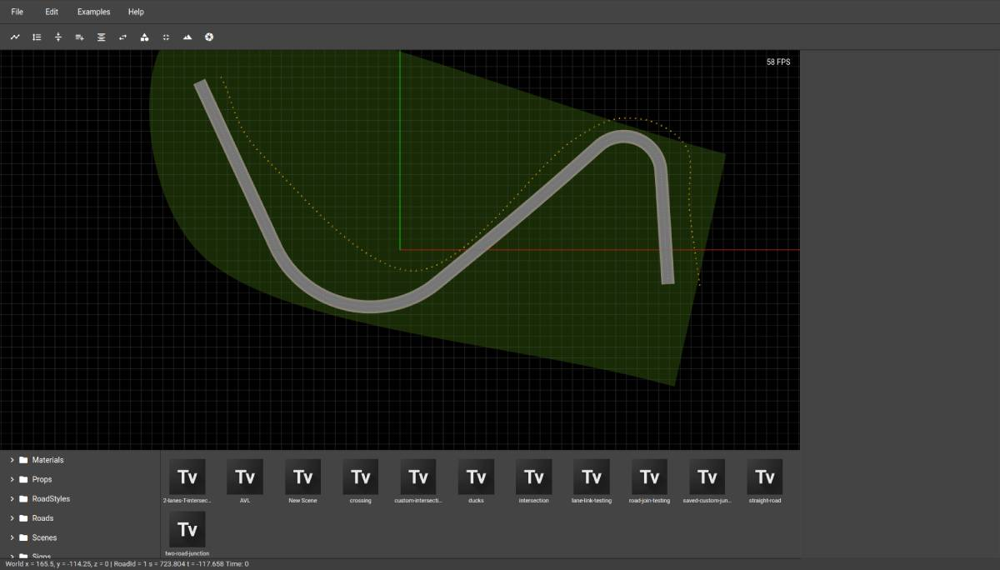

# Truevision Designer

Truevision Designer is a 3D tool to design roads, intersections and environments for testing and validating autonomous vehicles and robots.

From this repository you can build the Truevision Designer for Windows and Linux.

## Features

- Create and modify roads, lanes
- Import/Export OpenDrive 1.4
- Export to CARLA simulator
- Export 3D environment as GLTF or GLB file
- Import and place 3d assets in the environment using various prop tools

## Download

Click here to download [https://www.truevision.ai/download/designer](https://www.truevision.ai/download/designer)

## Documentation

Latest documentation can be found at [https://www.truevision.ai/designer/docs](https://www.truevision.ai/designer/docs)

## Tutorials

Latest tutorials and videos can be found at [https://www.youtube.com/channel/UCv4Gkf0Z0JyWdKQHakXpbAw/videos](https://www.youtube.com/channel/UCv4Gkf0Z0JyWdKQHakXpbAw/videos)

## Recommended System
- Intel i7 or above
- 16 GB RAM
- Ubuntu/Windows

## License

In brief, you are free to use, modify Truevision Designer for all non-commercial purposes only. Please read the license for more details.

Your access to and use of Truevision Designer on GitHub is governed by the Truevision Designer End User License Agreement. If you don't agree to those terms, as amended from time to time, you are not permitted to access or use Truevision Designer.
