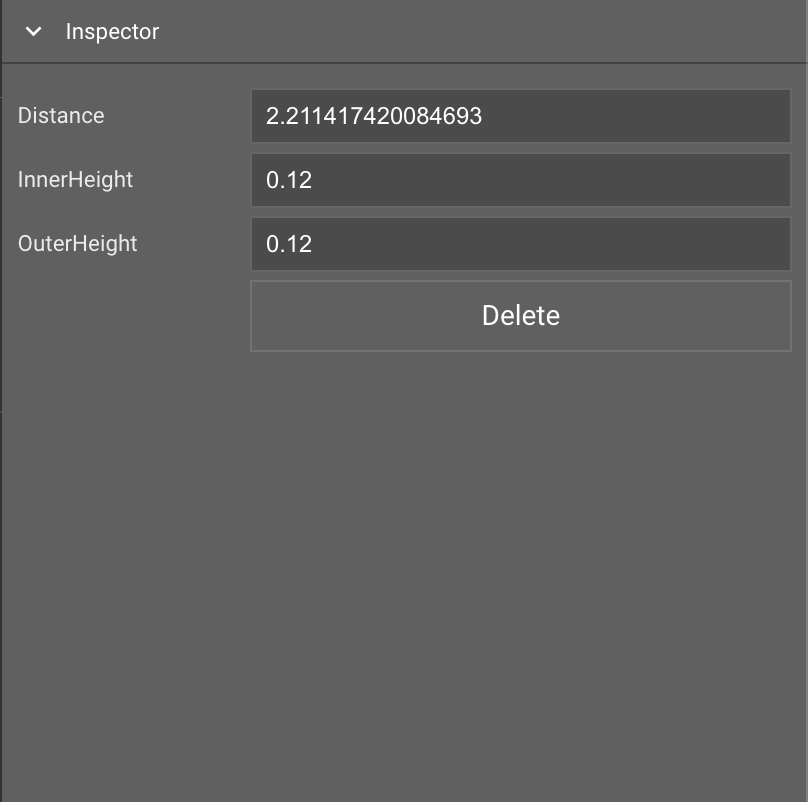

# Lane Height Tool

- [Lane Height Tool](#lane-height-tool)
	- [Overview](#overview)
	- [Tool Icon](#tool-icon)
	- [Select Lane](#select-lane)
	- [Inspector Window](#inspector-window)
	- [Create Lane Height Node](#create-lane-height-node)
	- [Adjust Lane Height Node](#adjust-lane-height-node)
	- [Delete Lane Height Node](#delete-lane-height-node)

## Overview

The Lane Height Tool is used to adjust height at desireed location on road. 

> Editing height of center lane is not supported

## Tool Icon

## Select Lane
1. Select `Lane Height Tool` from `Toolbar`
2. Press `Left Click` to select road which contains target lane
3. Press `Left Click` to select target lane on selected road

## Inspector Window 

> Inspector window will properties when a node is selected 

## Create Lane Height Node
1. Select `Lane Height Tool` icon from `Toolbar`
2. Press `Left Click` to select road which contains target lane
3. Press  `Left Click` to select target lane on selected road
4. Press `Shift` + `Left Click` to create a new height node

## Adjust Lane Height Node
1. Select `Lane Height Tool` icon from `Toolbar`
2. Press `Left Click` to select road which contains target lane
3. Press `Left Click` to select target lane on selected road
4. Press `Left Click` to select the target height node
5. Adjust `Height` values from `Inspector Window`

## Delete Lane Height Node
1. Select `Lane Height Tool` icon from `Toolbar`
2. Press `Left Click` to select road which contains target lane
3. Press `Left Click` to select target lane on selected road
4. Press `Left Click` to select the target height node
5. Press `Delete` key or Delete button in `Inspector Window` 
