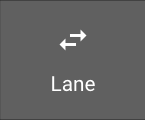
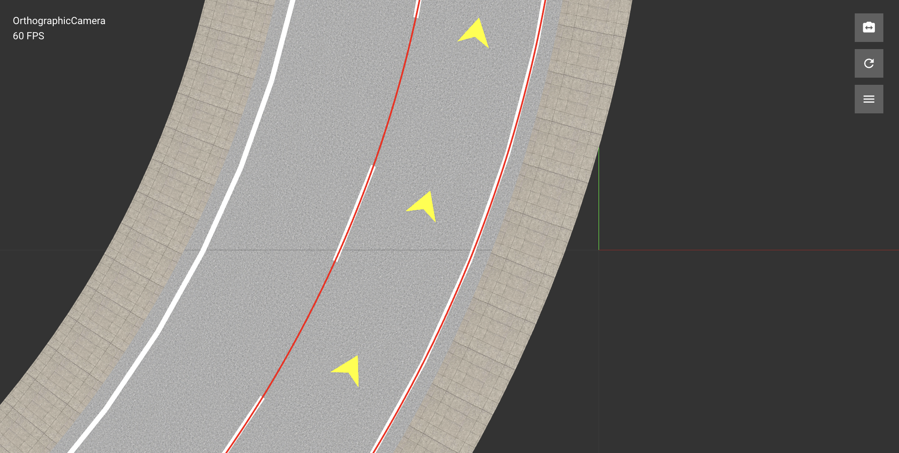
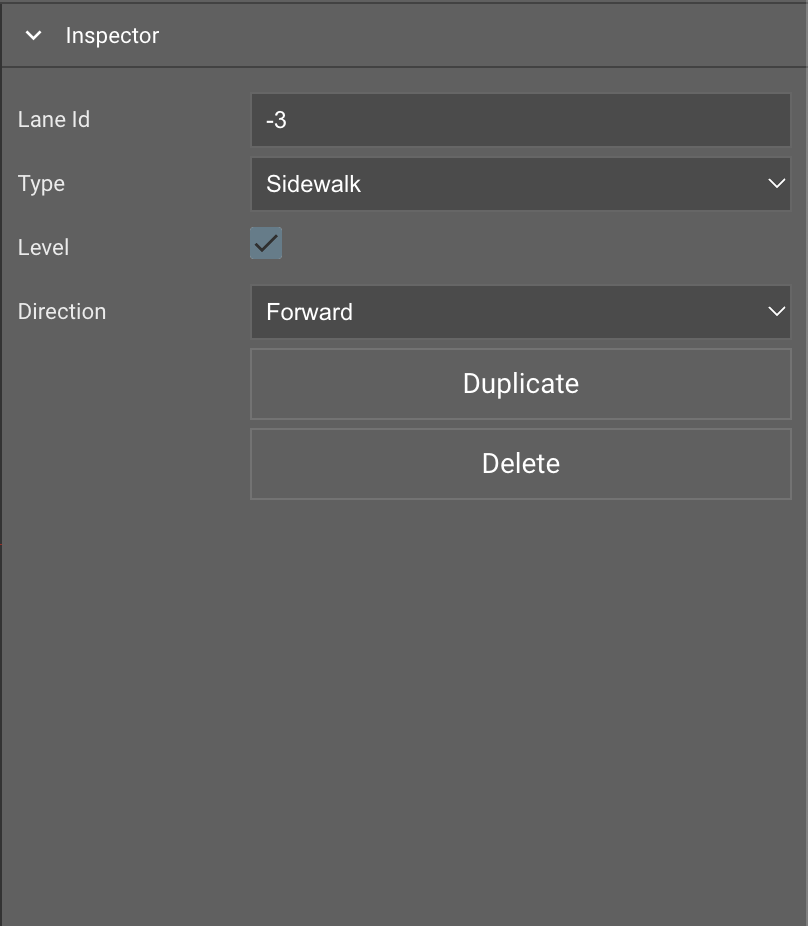
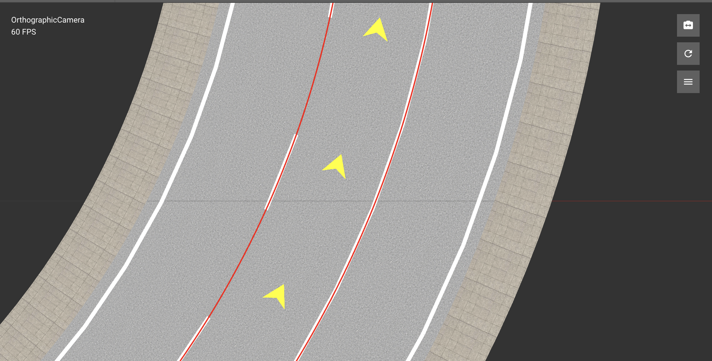

# Lane Tool

- [Lane Tool](#lane-tool)
	- [Overview](#overview)
	- [Tool Icon](#tool-icon)
	- [Select Lane](#select-lane)
	- [Inspector Window](#inspector-window)
	- [Duplicate Lane](#duplicate-lane)
	- [Change Lane Type](#change-lane-type)
	- [Change Lane Travel Direction](#change-lane-travel-direction)
	- [Delete Lane](#delete-lane)

## Overview

The Lane Tool is used to delete lanes, make changes to lane attributes, such as the lane type, and reverse lane travel directions.

## Tool Icon

## Select Lane
1. Select `Lane Tool` icon from `Toolbar`
2. Press `Left Click` to select road which contains target lane
3. Press `Left Click` to select target lane on selected road

> When pointer is above lane

> When lane is selected 

## Inspector Window 

> Inspector Window will show some properties when a lane is selected 

## Duplicate Lane
1. Select `Lane Tool` icon from `Toolbar`
2. Press `Left Click` to select road which contains target lane
3. Press `Left Click` to select target lane on selected road
4. Press `Duplicate` button in `Inspector Window` 

## Change Lane Type
1. Select `Lane Tool` icon from `Toolbar`
2. Press `Left Click` to select road which contains target lane
3. Press `Left Click` to select target lane on selected road
4. Select a lane type in the `Inspector Window`

## Change Lane Travel Direction
1. Select `Lane Tool` icon from `Toolbar`
2. Press `Left Click` to select road which contains target lane
3. Press `Left Click` to select target lane on selected road
4. Select a travel direction in the `Inspector Window`

## Delete Lane
1. Select `Lane Tool` icon from `Toolbar`
2. Press `Left Click` to select road which contains target lane
3. Press `Left Click` to select target lane on selected road
4. Press the `Delete` key or Delete button in `Inspector Window` or select `Edit > Delete` from the menu bar.
   
<!-- ## Reverse Lane Travel Direction
1. Select `Lane Tool` icon from `Toolbar`
2. Press `Left Click` to select road which contains target lane
3. Click a lane whose travel direction you want to reverse. The selected lane is highlighted in red. You can also select multiple roads and lanes to reverse their directions simultaneously.
4. On the toolbar to the left of the scene editing canvas, click the Reverse Travel Direction button.    -->
