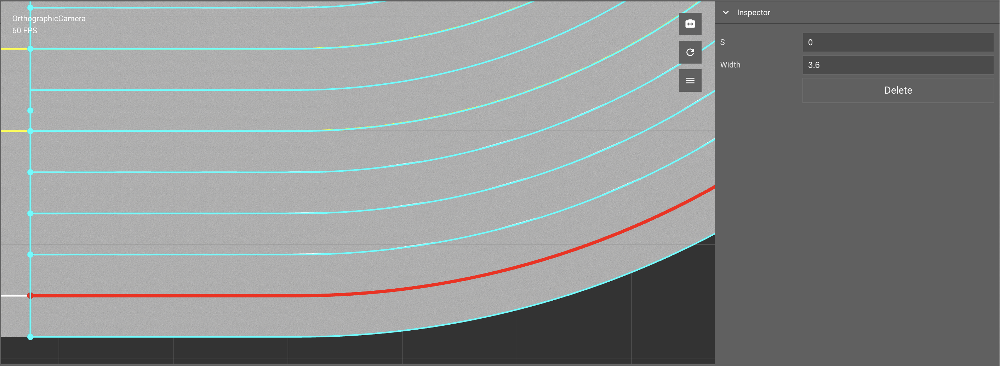
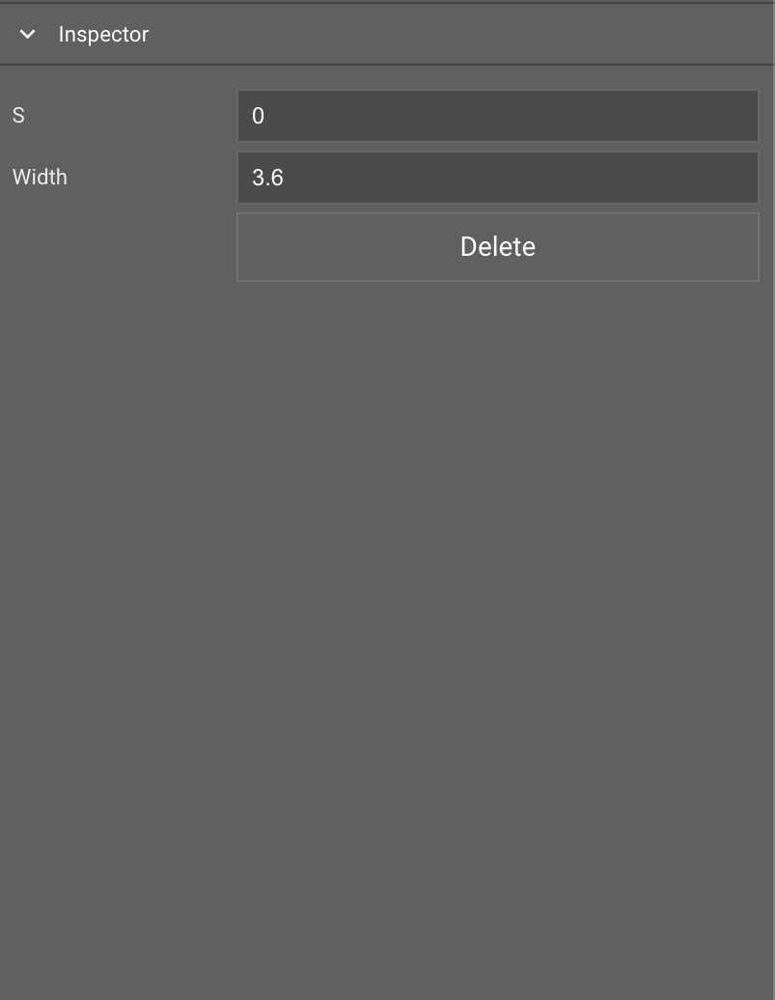
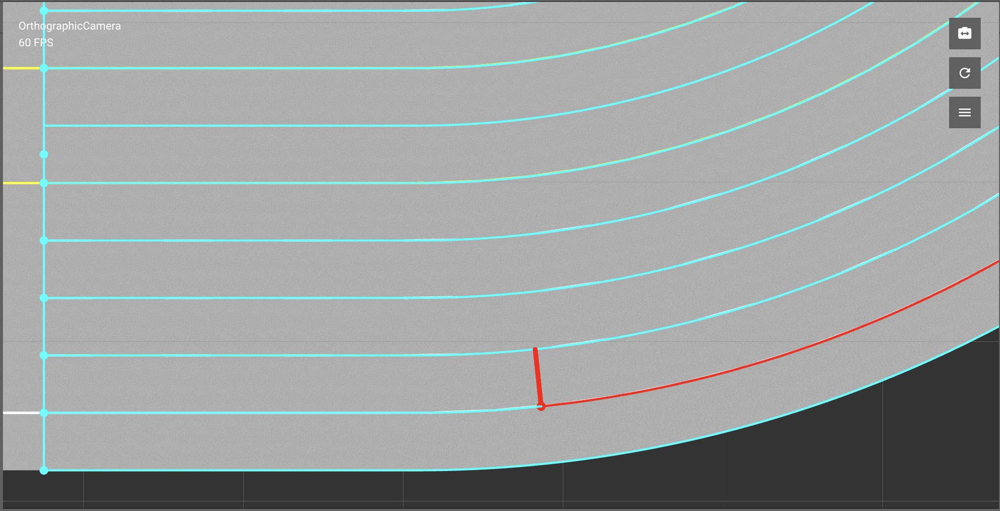

# Lane Width Tool

- [Lane Width Tool](#lane-width-tool)
	- [Overview](#overview)
	- [Tool Icon](#tool-icon)
	- [Select Lane](#select-lane)
	- [Inspector Window](#inspector-window)
	- [Create Lane Width Node](#create-lane-width-node)
	- [Adjust Lane Width Node](#adjust-lane-width-node)
	- [Delete Lane Width Node](#delete-lane-width-node)

## Overview

The Lane Width Tool is used to adjust width at desireed location on road. 

> Editing width of center lane is not supported through this tool 

## Tool Icon

## Select Lane
1. Select `Lane Width Tool` from `Toolbar`
2. Press `Left Click` to select road which contains target lane
3. Press `Left Click` to select target lane on selected road

## Inspector Window 

> Inspector Window will show some properties when a node is selected 

## Create Lane Width Node
1. Select `Lane Width Tool` icon from `Toolbar`
2. Press `Left Click` to select road which contains target lane
3. Press  `Left Click` to select target lane on selected road
4. Press `Shift` + `Left Click` to create a new width node

## Adjust Lane Width Node
1. Select `Lane Width Tool` icon from `Toolbar`
2. Press `Left Click` to select road which contains target lane
3. Press `Left Click` to select target lane on selected road
4. Press `Left Click` to select the target width node
5. Adjust `Width` value from `Inspector Window`

## Delete Lane Width Node
1. Select `Lane Width Tool` icon from `Toolbar`
2. Press `Left Click` to select road which contains target lane
3. Press `Left Click` to select target lane on selected road
4. Press `Left Click` to select the target width node
5. Press `Delete` key or Delete button in `Inspector Window` 
